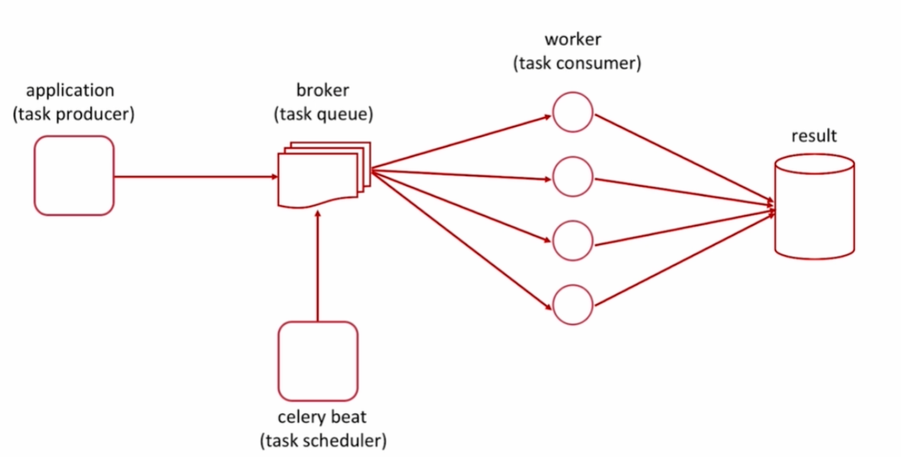

[TOC]

**参考链接**

[celery flower官网链接](https://flower.readthedocs.io/en/latest/config.html)

### celery是什么
- celery是一个简单,灵活且可靠的,处理大量消息的分布式系统
- 专注于实时处理的异步任务队列
- 同时也支持任务调度




### 使用场景
- 异步任务:将耗时操作任务提交给celery去异步执行,比如发送短信/邮件,消息推送,音视频处理
- 定时任务:类似于crontab,比如每日数据统计

### 安装
[python环境配置参考](https://www.cnblogs.com/anyux/p/18437070)
```bash
pip install celery
docker run --name redis --cap-add=SYS_PTRACE --security-opt seccomp=unconfined -d -p 6379:6379 registry.cn-hangzhou.aliyuncs.com/k8s-a/redis:6.2
```

### celery命令

#### 定义消费者(worker)
tasks.py,定义消费者可以执行的任务
```python
from celery  import Celery
import time

# borker是消息队列,用于生产者与消费者通信,生产者将任务发布到broker,消费者从broker获取任务
broker='redis://127.0.0.1:6379/0'
# backend是结果后端,用于存储任务执行结果
backend='redis://127.0.0.1:6379/1'
# 创建一个名为task的Celery实例,通过此实例,注册,发布,管理任务
app = Celery('task', broker=broker,backend=backend)

#@app.task() 将普通函数注册为Celery任务,此函数可被Celery调度分配异步执行
@app.task()
def add(x,y):
    return x + y

#通过sleep函数,模拟耗时任务
@app.task()
def add2(x,y):
    time.sleep(5)
    return x + y
```
#### 启动消费者
启动Celery实例
```bash
#tasks是指向tasks.py文件,worker是Celery工作进程,-l INFO是日志级别 
celery -A tasks worker -l INFO 

```
#### 查看消费者启动日志
celery worker 启动打印日志如下
```ini
[config]
# task是Celery('task', broker=broker,backend=backend)的Celery实例名称
.> app:         task:0x7f3c0d4c7810
# transport为任务队列
.> transport:   redis://127.0.0.1:6379/0
# results 为结果后端
.> results:     redis://127.0.0.1:6379/1
# concurrency 并发数量
.> concurrency: 2 (prefork)
# task events: OFF 表示关闭任务监控功能,-E参数可打开此功能
.> task events: OFF (enable -E to monitor tasks in this worker)

# 队列配置信息
[queues]
# celery 是队列的名称,默认是celery,用于发送和接收任务
# exchange是消息交换机,direct表示消息会直接路由到匹配的队列
# key=celery 表示路由键,默认情况下，所有的任务都会使用这个路由键并被发送到 celery 队列
.> celery           exchange=celery(direct) key=celery

#任务列表,表示worker已启动识别下面的任务
#当生产者向celery发送任务时,worker会从队列中取出任务并执行
[tasks]
. tasks.add
. tasks.add2
```
#### 定义生产者(producer)
生产者是发布任务的部分,即将任务发送到消息队列(broker)
app.py示例

```python
from tasks import add,add2

#异步调用add(2,3)任务,并将任务推送到消息队列
#返回AsyncResult对象,表示状态和结果
t = add.delay(2,3)
print(t)
#获取任务结果,会阻塞当前进程,直接到任务结束返回结果
#如果任务失败抛出异常,celery.exceptions.TaskRevokedError
t.get()

#获取任务执行结果,不会阻塞
#任务未执行完,返回None
t.result

#检查任务是否执行完成
#True: 表示任务完成,无论成功,失败,还是取消
#False: 任务还在执行中
t.ready()

#返回任务的当前状态
#PENDING: 任务还未开始执行
#STARTED: 任务已开始执行
#RETRY: 任务正在重试
#FAILURE: 任务执行失败
#SUCCESS: 任务执行成功
t.status

#返回任务id
t.id

#异步调用add2(4,5)任务,并将任务推送到消息队列
t = add2.delay(4,5)
print(t)
```
输出内容如下
```
In [4]: add2.delay(4,4)
# 61bdb7ec-6d98-4c91-abeb-cd3f84158627是任务的唯一id,通过id查询任务状态和结果
Out[4]: <AsyncResult: 61bdb7ec-6d98-4c91-abeb-cd3f84158627>

In [5]: t=add2.delay(4,4)

In [6]: t
Out[6]: <AsyncResult: 5c9f5b5b-70a9-4e71-82ad-84f449a334ba>
```


